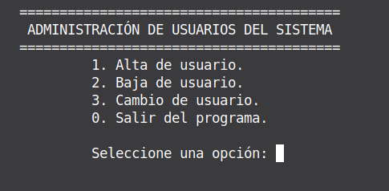
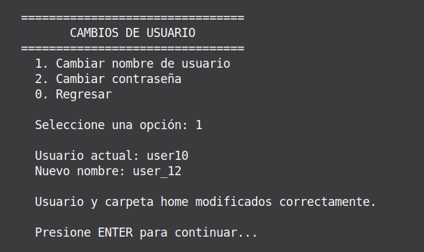
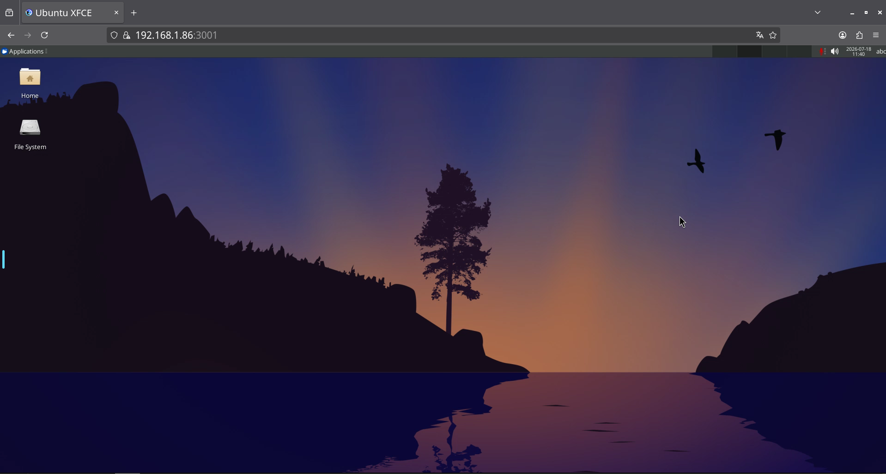

# Administración de Servidor Linux

Sistema desarrollado en **TCL** para la administración de usuarios y automatización de tareas dentro de un entorno Linux.

El proyecto proporciona una interfaz basada en menús que permite gestionar usuarios mediante scripts automatizados, así como configurar y validar servicios fundamentales dentro de un servidor Linux.

Además de las operaciones de administración de usuarios, el sistema incorpora la configuración de servicios de red como SSH, FTP y CUPS, junto con un entorno Linux accesible desde navegador mediante Docker, lo que facilita la realización de pruebas, demostraciones y actividades de administración en un entorno controlado.

Esta solución combina automatización mediante TCL, herramientas propias del ecosistema Linux y tecnologías de contenedorización para centralizar tareas comunes de administración del sistema, reduciendo la necesidad de ejecutar procedimientos manuales repetitivos.

<p align="center">
    <br>
    <em>Figura 1. Menú principal del sistema de administración.</em><br>
</p>

## Tecnologías utilizadas

* Linux
* TCL
* Docker
* Docker Compose
* Bash

## Funcionalidades

* Alta, baja y modificación de usuarios mediante scripts TCL.
* Menú interactivo de administración.
* Configuración y validación del servicio SSH.
* Configuración y validación del servicio FTP.
* Configuración y validación del servicio CUPS.
* Despliegue de un entorno Linux accesible desde navegador mediante Docker.
* Automatización básica de tareas de administración del sistema.

<p align="center">
    <br>
    <em>Figura 2. Modificación de información de usuarios mediante scripts TCL.</em><br><br>
</p>

<p align="center">
    <br>
    <em>Figura 3. Entorno Linux accesible mediante Docker y navegador web.</em><br>
</p>

## Estructura del proyecto

```text
Administracion-Servidor-Linux/
│
├── screenshots/
│   ├── menu_administracion.png
│   ├── cambios_usuario.png
│   └── linux_webtop_docker.png
│
├── alta_usuario..tcl                -> Gestión de altas de usuarios.
│
├── baja_usuario.tcl                -> Gestión de eliminación de usuarios.
│
├── cambios_usuario.tcl                -> Modificación de información de usuarios.
│
├── docker-compose.yml                -> Configuración de un entorno Linux Webtop remoto desplegado mediante Docker.
│
├── menu.tcl                -> Menú principal y punto de entrada del sistema
│
└── README.md
```

## Documentación

La documentación técnica del proyecto se encuentra disponible en:

* `docs/Reporte-Administracion-Servidor-Linux.pdf`


## Autores

* Suárez Vega, Vladimir
* Zermeño Ojeda, Paola Sarahi
* Zermeño Ojeda, Diana Valeria

## Nota

Proyecto desarrollado originalmente con fines académicos y educativos para practicar y fortalecer conocimientos relacionados con administración de sistemas Linux, automatización mediante scripts TCL, gestión de usuarios, configuración de servicios de red, uso de contenedores Docker y operación básica de entornos Linux.

La máquina virtual utilizada durante el desarrollo del proyecto no se encuentra incluida en el repositorio debido a su tamaño.

El repositorio contiene el sistema de administración de usuarios desarrollado en TCL, la configuración del entorno Docker y la documentación técnica necesaria para reproducir el entorno y los servicios configurados durante el proyecto.


### Historial del Proyecto

- Desarrollo original y publicación en Github: **junio de 2026**.